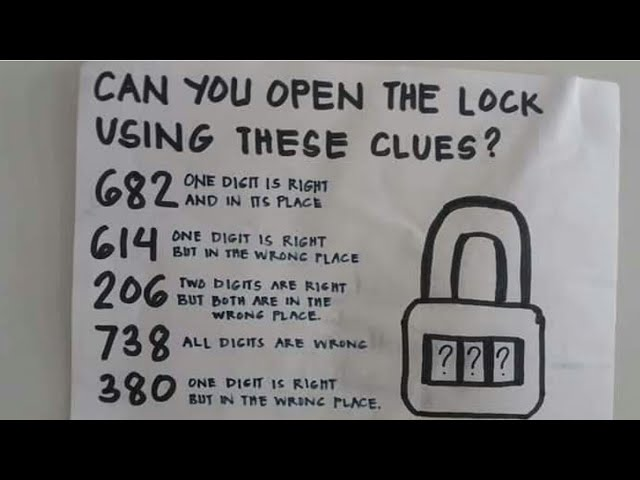

# Can you open the lock using clues?

A python implementation of a simple puzzle game in which the ultimate goal is to guess a number (like a secret code of a lock). After each guess, the program gives a clue as to how many digits of the guess are correct and whether they are in the right place or not.

### Where does this game come from?
In recent months, similar examples of this puzzle have gone viral on social media, like the one below. In principle, this game is similar to <a href="https://en.wikipedia.org/wiki/Mastermind_(board_game)">Mastermind</a> or its older predecessor <a href="https://en.wikipedia.org/wiki/Bulls_and_Cows">Bulls and Cows</a>. 

